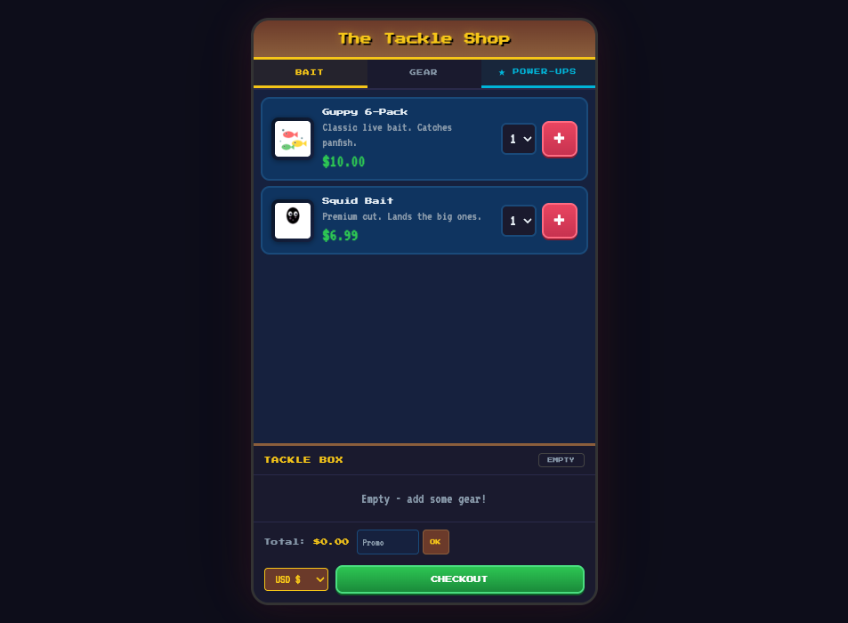
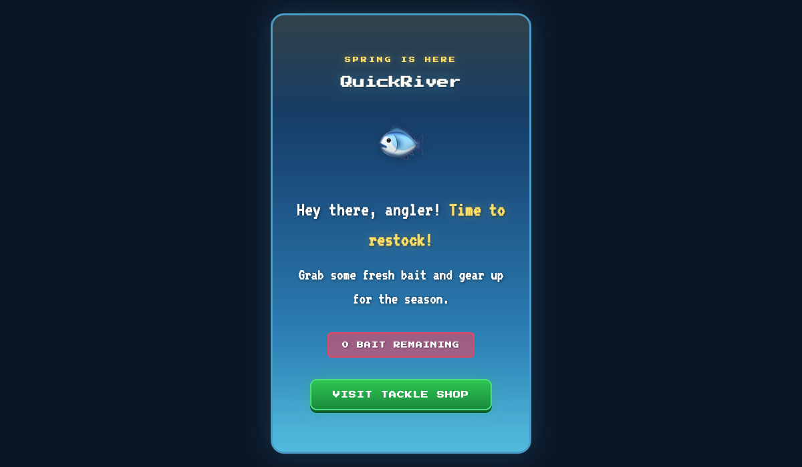
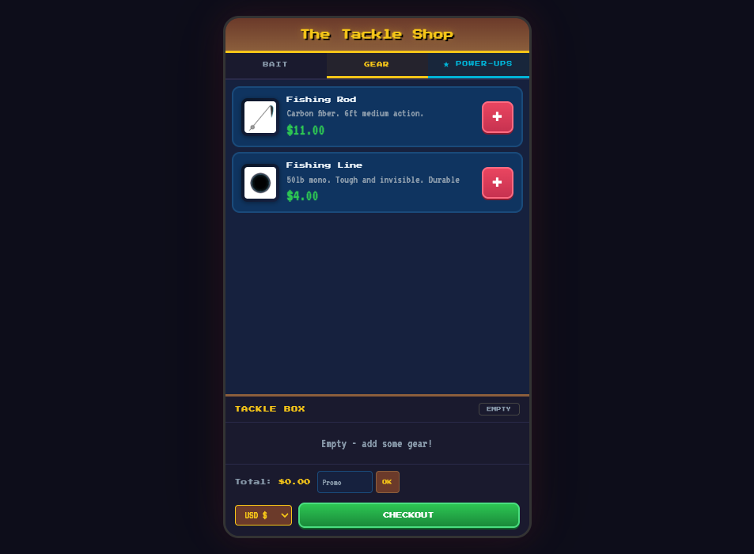
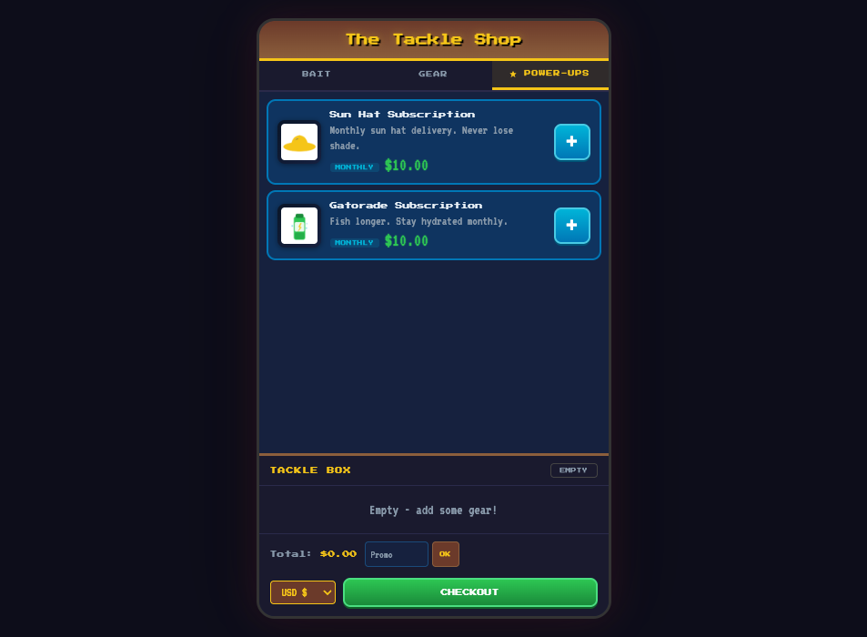
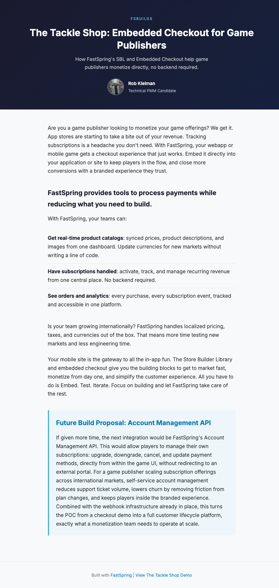

# QuickRiver: The Tackle Shop

A proof-of-concept fishing game storefront demonstrating FastSpring's embedded checkout and Store Builder Library (SBL) for mobile app and game publishers.

https://github.com/user-attachments/assets/2a5884c5-7d67-40ce-93f2-a57dc22094c7

**[Live Demo](https://rkrevolution.github.io/quickriver/)** | **[Blog Post](https://rkrevolution.github.io/quickriver/blogpost/)** | **[Video Walkthrough](https://www.youtube.com/watch?v=Z8PqM-4SsSY&t=77s)**



## Overview

QuickRiver simulates a mobile fishing game's in-app store ("The Tackle Shop") where players can purchase bait, gear, and subscription power-ups. The entire storefront runs on the client side using FastSpring's Store Builder Library (SBL) directives and embedded checkout, requiring no custom backend for payments.

The app is built with plain HTML, CSS, and JavaScript to keep things simple and demonstrate how game publishers can monetize directly without app store fees.

## Pages

### Welcome Screen

The landing page presents the player with a "0 BAIT REMAINING" prompt, driving them into the tackle shop.



### The Tackle Shop

The main storefront features three product tabs:

**Bait** - One-time purchases like the Guppy 6-Pack ($10.00) and Squid Chunks ($6.99), with quantity selectors.

**Gear** - One-time equipment purchases including a Fishing Rod ($11.00) and Fishing Line ($4.00).



**Power-Ups** - Monthly subscriptions such as the Sun Hat Subscription ($10.00/mo) and Gatorade Subscription ($10.00/mo).



The "Tackle Box" cart at the bottom shows selected items, a running total, promo code input, and a currency switcher (USD, GBP, EUR, JPY, AUD, CAD, BRL). Clicking **CHECKOUT** opens FastSpring's embedded checkout form directly within the app.

### Blog Post

A companion article explaining the technical approach and proposing a future Account Management API integration.



## How It Works

### FastSpring Store Builder Library (SBL)

Product data (names, prices, descriptions, images) is pulled live from FastSpring using SBL data attributes on HTML elements:

```html
<div data-fsc-item-path="guppy-6-pack">
  <span data-fsc-item-display></span>
  <span data-fsc-item-price></span>
  <span data-fsc-item-description-summary></span>
  
  <button data-fsc-action="Add">+</button>
</div>
```

### Product Preload Pattern

On page load, `app.js` pushes all products into the FastSpring session to populate the cache, then resets the cart so the user starts clean. This ensures every product card displays live data immediately.

### Cart and Checkout

- Adding/removing items uses SBL directives (`data-fsc-action="Add"`, `"Remove"`, `"Reset"`)
- A `dataCallback` fires on every session change, syncing the custom cart UI with FastSpring's state
- Currency switching calls `fastspring.builder.country()` to re-render all prices
- Checkout renders inside an embedded container via `fastspring.builder.checkout()`

### Webhook Worker

A Cloudflare Worker (`worker/`) listens for FastSpring webhook events (`order.completed`, `subscription.activated`) for order and subscription tracking.

## Product Catalog

| Product | Price | Type |
|---------|-------|------|
| Guppy 6-Pack | $10.00 | One-time |
| Squid Chunks | $6.99 | One-time |
| Fishing Rod | $11.00 | One-time |
| Fishing Line | $4.00 | One-time |
| Sun Hat Subscription | $10.00/mo | Subscription |
| Gatorade Subscription | $10.00/mo | Subscription |

## Project Structure

```
public/
  index.html          Main shop interface
  welcome.html        Landing screen
  app.js              Tab switching, cart rendering, SBL preload, checkout
  styles.css          Full UI styling (retro gaming theme)
  blogpost/index.html Case study article
  images/             Product and asset images
worker/
  src/index.js        Cloudflare Worker webhook handler
  wrangler.toml       Worker configuration
server.js             Express server (local development)
package.json          Dependencies
```

## Running Locally

```bash
npm install
npm start
```

The app runs at `http://localhost:3000`. Visit `/welcome` for the landing page or `/` for the shop directly.

## Tech Stack

- **Frontend**: HTML, CSS, JavaScript (no frameworks)
- **Payments**: FastSpring Store Builder Library + Embedded Checkout
- **Server**: Express (static file serving)
- **Webhooks**: Cloudflare Workers
- **Fonts**: VT323, Press Start 2P (retro gaming aesthetic)

## Author

**Rob Kleiman** - Technical PMM Candidate
